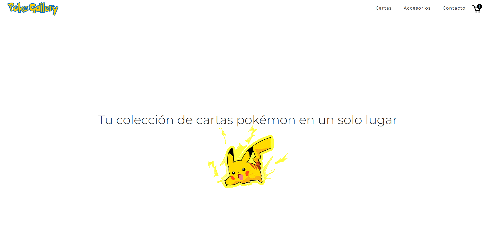

# PokeGallery E-commerce


## 📝 Descripción

PokeGallery es un e-commerce especializado en cartas Pokémon TCG. Desarrollado con JavaScript vanilla, HTML y CSS, ofrece una experiencia fluida para explorar y comprar cartas coleccionables.

[Deploy para obtener un vistazo 🚀](https://pabloechegaray97.github.io/PokeGallery-E-commerce/)

## ✨ Características

- 🔍 Búsqueda y filtrado de cartas por categoría
- 🛒 Carrito de compras interactivo
- 💳 Simulación de proceso de compra
- 📱 Diseño responsive
- 🎨 Interfaz intuitiva y amigable
- 🃏 Integración con API de Pokémon TCG
- 💾 Persistencia de datos en localStorage

## 🛠️ Tecnologías Utilizadas

- HTML5
- CSS3
- JavaScript (ES6+) Vanilla
- Bootstrap 5
- SweetAlert2
- Toastify
- BoxIcons

## 📸 Capturas de Pantalla




## 🚀 Instalación

1. Cloná el repositorio

```bash
git clone https://github.com/PabloEchegaray97/PokeGallery-E-commerce.git
```

2. Abrí el proyecto
```bash
cd PokeGallery-E-commerce
```

3. Abrí index.html en tu navegador preferido o usá live server

## 💡 Uso

- Explorá el catálogo de cartas
- Filtra por categoría usando el selector
- Agregá cartas al carrito
- Revisá tu carrito haciendo clic en el ícono superior

## 👤 Autor

**Pablo Echegaray**
- LinkedIn: [Pablo Echegaray](https://www.linkedin.com/in/pablo-echegaray-a4a000241/)
- GitHub: [@PabloEchegaray97](https://github.com/PabloEchegaray97)
